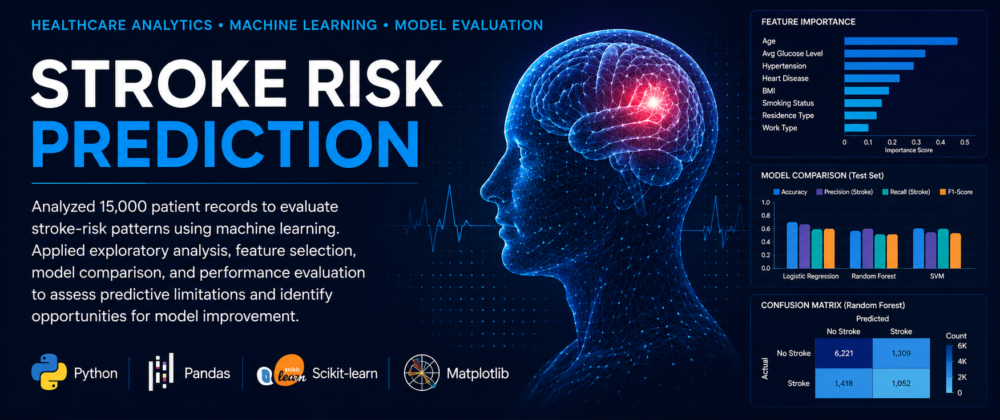
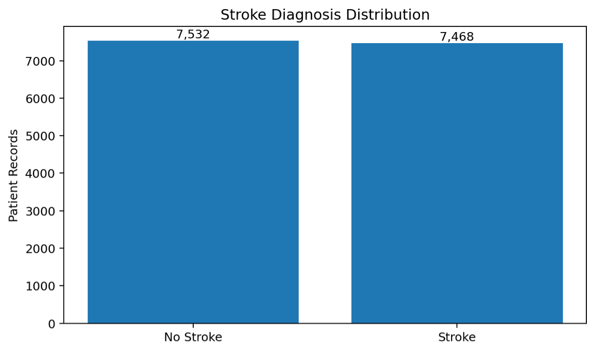
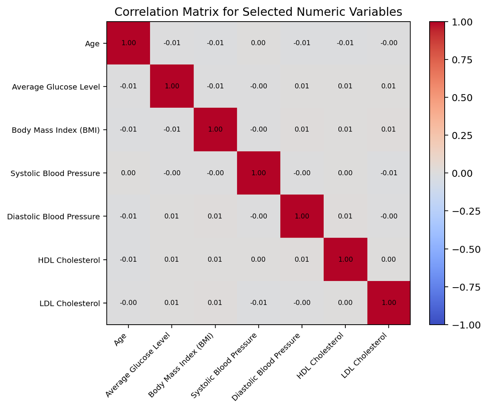
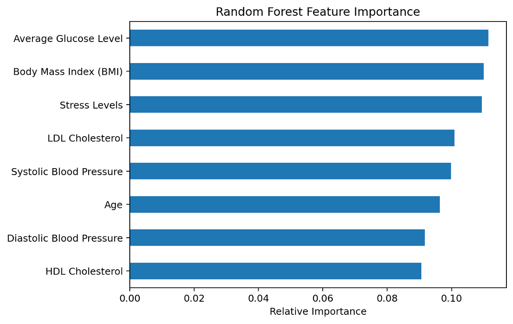

<div align="center">

# Healthcare Stroke Risk Prediction

### Machine Learning & Healthcare Analytics Portfolio Project



<br>


---

### Transforming healthcare data into actionable insights through predictive analytics.

</div>

---

# Project Overview

This project explores healthcare data to identify factors associated with stroke risk and evaluates multiple machine learning models capable of predicting stroke outcomes.

The project demonstrates an end-to-end healthcare analytics workflow including:

- Data Cleaning
- Exploratory Data Analysis (EDA)
- Feature Engineering
- Machine Learning
- Model Evaluation
- Executive Reporting

Rather than focusing solely on predictive accuracy, this project emphasizes analytical thinking, reproducible workflows, and communicating technical findings in a professional healthcare setting.

---

# Business Problem

Stroke remains one of the leading causes of disability and mortality worldwide.

Healthcare organizations collect large volumes of patient information every day. Transforming that information into meaningful insights can support risk stratification, preventive care planning, population health initiatives, and data-driven decision making.

This project explores whether demographic, clinical, and lifestyle variables can be leveraged to estimate stroke risk while demonstrating a complete healthcare analytics workflow.

---

# Project Objectives

- Explore relationships among healthcare variables.
- Perform exploratory data analysis.
- Develop predictive machine learning models.
- Compare multiple classification algorithms.
- Evaluate model performance.
- Present analytical findings through executive reporting.

---

# Technologies Used

| Category | Technologies |
|-----------|--------------|
| Programming | Python |
| Data Analysis | Pandas, NumPy |
| Machine Learning | Scikit-learn |
| Visualization | Matplotlib, Tableau |
| Development | Jupyter Notebook |
| Version Control | Git & GitHub |

---

# Project Workflow

```text
Healthcare Dataset
        │
        ▼
Data Cleaning
        │
        ▼
Exploratory Data Analysis
        │
        ▼
Feature Engineering
        │
        ▼
Machine Learning Models
        │
        ▼
Model Evaluation
        │
        ▼
Executive Report
```

---

# Key Results

Completed an end-to-end healthcare analytics workflow.

Compared Logistic Regression, Random Forest, and Support Vector Machine models.

Created a professional executive report summarizing analytical findings.

Demonstrated responsible interpretation of machine learning results and project limitations.

---

# Project Highlights

## Stroke Diagnosis Distribution


---

## Correlation Analysis



---

## Feature Importance



---

# Executive Project Report

A professional management-level report is available in the **reports** folder.

The report includes:

- Executive Summary
- Dataset Overview
- Methodology
- Exploratory Data Analysis
- Machine Learning Results
- Healthcare Relevance
- Business Impact
- Limitations
- Future Improvements

---

# Repository Structure

```text
Healthcare-Stroke-Risk-Prediction/

│
├── README.md
├── LICENSE
├── requirements.txt
│
├── data/
│   └── stroke_prediction_dataset_deidentified.xlsx
│
├── images/
│
├── notebooks/
│   └── Stroke_Risk_Prediction.ipynb
│
└── reports/
   └── Stroke_Risk_Prediction_Executive_Report.pdf
```

---

# Future Improvements

- Hyperparameter tuning
- Cross-validation
- Explainable AI (SHAP)
- XGBoost implementation
- ROC-AUC evaluation
- Interactive Tableau dashboards
- Streamlit deployment

---

# About the Author

## Angeline Duarte

**Healthcare Operations & Technology | Systems Analysis | Data Analytics**

This repository is part of my professional portfolio showcasing healthcare analytics, machine learning, and healthcare technology projects.

- Portfolio: [Click Here](https://www.angelineduarte.com/)
- LinkedIn: [Click Here](https://www.linkedin.com/in/angelineduarte/)

---

## If you found this project interesting, feel free to explore the repository or connect with me on LinkedIn.
